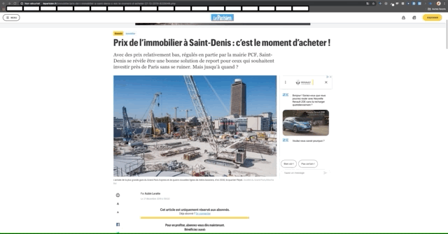
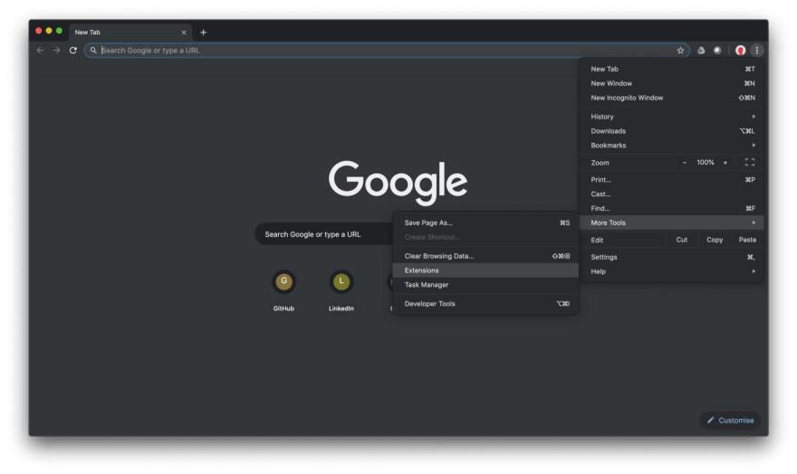
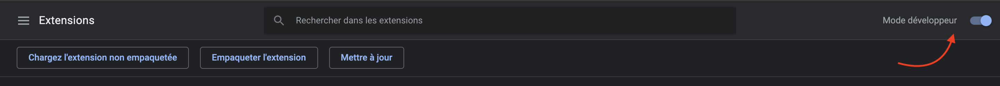
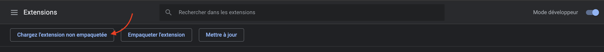
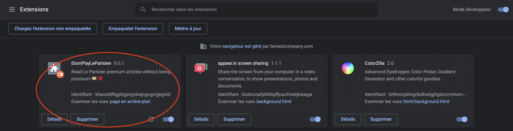

# iDontPayLeParisien

A chrome extention allowing you to read Le Parisien premium articles without being premium 💵❌

## How to run this extension on chrome locally

0. Launch `Google Chrome`, click on `three dots icon` (top right corner) -> `More tools` -> `Extension`.

1. Enable `developer mode`

2. Click on `load unpacked extension` and choose `iDontPayLeParisien` folder

3. You should see `iDontPayLeParisien` card in your extentions list

4. Use `iDontPayLeParisien` by clicking the extension icon on `Le Parisien premium articles`
